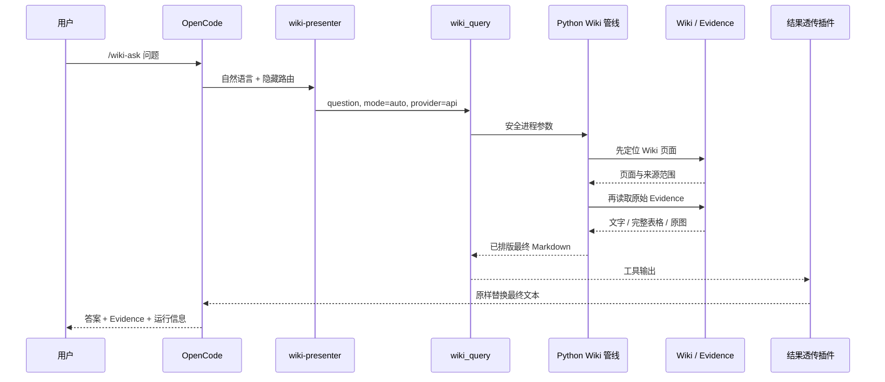
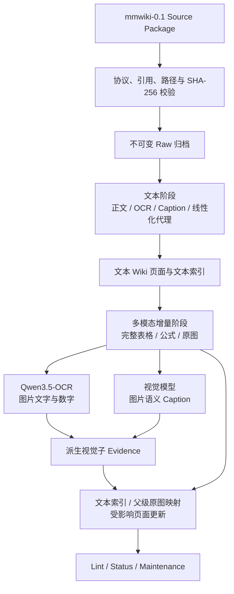

# `multimodal-wiki` Skill 架构说明

## 1. Skill 的定位

本项目已经封装为 OpenCode 项目级 `multimodal-wiki` Skill。用户在 OpenCode 中通过该 Skill 完成 Wiki 导入、状态检查、技术导览、效果对比和图文问答，不需要直接操作底层 Python 管线。

这里的“封装成 Skill”不是把全部算法写进一个 `SKILL.md`，而是以 Skill 为统一能力入口，组合斜杠命令、专用 Agent、类型化工具、演示脚本和结果透传插件，再调用底层多模态 Wiki 引擎。这样既保留 Skill 的自然语言交互体验，也保留后端代码的确定性、可测试性和独立运行能力。

各层职责如下：

| 层级 | 职责 |
|---|---|
| OpenCode | 接收自然语言和 `/wiki-*` 命令，承载 Agent 与工具调用 |
| `multimodal-wiki` Skill | 对外封装 Wiki 能力，定义工作流、工具选择、证据要求、安全边界和结果格式 |
| `wiki-presenter` Agent | 根据命令和 Skill 约束调用一个类型化 `wiki_*` 工具 |
| 类型化工具 | 校验结构化参数，安全调用 Python，不使用 Shell 拼接用户问题 |
| Python Wiki 管线 | 执行构建、页面导航、Evidence 检索、模型调用和 Citation 校验 |
| Wiki 页面与 Evidence | 分别承担知识组织和事实证明 |
| 结果透传插件 | 将后端生成的最终 Markdown 原样交付给用户 |

一句话概括：**多模态 Wiki 以 Skill 形式提供给用户；Skill 统一编排，类型化工具安全连接，Python 管线执行核心逻辑。**

## 2. 总体架构

```mermaid
flowchart LR
    U[用户]

    subgraph B[OpenCode 项目级 multimodal-wiki Skill 能力包]
        C[自然语言或 /wiki-* 命令]
        S[SKILL.md<br/>工作流与安全规范]
        A[wiki-presenter Agent]
        T[类型化 wiki_* 工具]
        X[结果透传插件]

        C --> A
        S -.约束.-> A
        C -.隐藏路由元数据<br/>mmwiki-action.-> A
        A --> T
    end

    U --> C
    T --> D[tools/opencode_demo.py]
    T -.wiki_import.-> P[app.py / Python Wiki Pipeline]
    D --> P

    P --> W[持久 Wiki 页面<br/>Page BM25 / Page Embedding]
    W --> E[原始 Evidence<br/>Chunk / Item / Asset]
    E --> M[文本模型或视觉语言模型]
    M --> R[最终 Markdown<br/>结论 / Wiki 定位 / Evidence / 运行信息]

    R --> X
    X --> O[OpenCode 最终展示]
    O --> U

    P -.仅监听 127.0.0.1:19828.-> H[Wiki 页面与原图服务]
    R --> H
```

这套架构把需要语言理解的部分与必须确定执行的部分分开：

- Agent 负责理解命令并选择工具；
- 类型化工具负责参数边界和进程调用；
- Python 管线负责可测试的业务逻辑；
- 透传插件保证链接、表格、公式、Evidence ID 和模型信息不被二次改写。

## 3. 目录与组件

```text
.opencode/
├── skills/multimodal-wiki/
│   ├── SKILL.md                  # Agent 操作规范与安全约束
│   ├── README.md                 # 本架构说明
│   ├── references/architecture.md # 基线与多模态增量的评测契约
│   ├── scripts/demo.sh           # CLI 演示与本地服务入口
│   └── agents/openai.yaml        # Skill 元数据
├── commands/wiki-*.md            # 用户可见的中文斜杠命令
├── agents/wiki-presenter.md      # 只调用工具、不得重写结果的 Agent
├── tools/wiki.ts                 # 类型化 wiki_* 工具
└── plugins/wiki-result-passthrough.ts # 最终结果确定性透传
```

后端主要入口：

```text
app.py                       # Wiki CLI 与本地 API
tools/opencode_demo.py       # OpenCode 演示适配层
mmwiki/pipeline.py           # 构建与查询主流程
mmwiki/retrieval.py          # 页面导航和 Evidence 检索
mmwiki/ocr.py                # Qwen3.5-OCR 图片文字提取
mmwiki/visual_evidence.py    # OCR/Caption 子 Evidence 与父级原图映射
mmwiki/contracts.py          # mmwiki-0.1 输入校验
runtime/vault/               # Wiki 页面、索引和运行状态
runtime/raw/                 # 不可变来源副本
```

## 4. 一次查询如何执行

以 `/wiki-ask 请解释 Figure 4 的数据流` 为例：

1. `/wiki-ask` 展示自然语言问题，同时用不可见的 `mmwiki-action` 注释指定 `wiki_query`、`mode=auto` 和 `provider=api`。
2. `wiki-presenter` 读取路由信息，只调用 `wiki_query`，不把问题拼成 Bash 命令。
3. `wiki_query` 通过结构化参数把完整问题传给 `tools/opencode_demo.py`，必要时启动 `127.0.0.1:19828` 本地展示服务。
4. Python 管线先检索持久 Wiki 页面，得到相关知识范围和来源范围。
5. 系统再检索 Chunk、Item 和 Asset Evidence。图片 OCR 与语义 Caption 作为派生子 Evidence 参与 BM25 和文本向量检索；命中后仍回到父级 Item、Chunk、Asset 和原图。普通事实与表格问题通常进入 Hybrid；颜色、箭头、布局和图内关系问题进入 Multimodal。
6. 模型只能依据候选 Evidence 生成答案。Citation 必须属于本次候选集合，否则查询失败。
7. 后端生成完整 Markdown，固定包含“结论、Wiki 定位、原始 Evidence、运行信息”。
8. `wiki-result-passthrough` 用工具原始输出替换模型的二次表述，OpenCode 最终展示完整表格、原图和可点击链接。



## 5. Wiki 构建工作流

Skill 规定新 Source Package 按两个阶段构建，便于复用文本结果并计算多模态增量成本：



关键约束：

- 文本阶段不得读取图片像素或使用完整表格单元格；
- 多模态阶段复用同一 `source_id + source_version + item_id`，不建立平行知识库；
- OCR 与 Image Caption 只补充图片的可检索表示，不替代原始图片 Evidence，也不机械创建新 Wiki 页面；
- 派生视觉 Evidence 存入 `runtime/state.json`，按图片 SHA-256 缓存于 `runtime/build-cache/visual/`；
- 相同来源版本重复导入返回 `unchanged`，不重复调用模型；
- 查询只追加运行日志，不自动把答案写入稳定知识页；
- Source Package 和 `runtime/raw/` 中的来源副本不可修改。

当前类型化工具主要覆盖演示、状态、已有 Wiki 导入和查询。新 Source Package 的完整两阶段构建仍按 [SKILL.md](SKILL.md) 中的 CLI 流程执行。

## 6. 命令与工具映射

| 用户命令 | 类型化工具 | 用途 |
|---|---|---|
| `/wiki-start` | `wiki_start` | 显示零基础入口和数据规模 |
| `/wiki-check` | `wiki_status` | 检查页面、索引、模型和本地服务 |
| `/wiki-demo` | `wiki_tour` | 展示完整构建与问答导览 |
| `/wiki-compare` | `wiki_compare` | 查看文本基线与多模态增量对比 |
| `/wiki-questions` | `wiki_questions` | 显示推荐演示问题 |
| `/wiki-table` | `wiki_query` | 演示完整表格回读 |
| `/wiki-image` | `wiki_query` | 演示原图理解 |
| `/wiki-refuse` | `wiki_query` | 演示证据不足拒答 |
| `/wiki-ask <问题>` | `wiki_query` | 自由图文问答 |

`wiki_import` 没有固定演示命令，用于只读导入已有 Markdown Wiki，并结合 MinerU Source Package 中的 Caption 生成派生视图。

## 7. Skill 解决的问题

如果只提供 Python 脚本，用户需要自行判断检索模式、工具参数、证据格式和错误处理。Skill 将这些规则固定下来：

1. 首次使用时只展示必要命令，不先暴露底层 JSON、API 和脚本参数；
2. 普通问题与视觉问题使用统一 `auto` 入口，由后端根据配置和问题意图选择路径；
3. 回答必须回到原始 Evidence，Wiki 页面只负责定位，不作为最终事实证明；
4. Caption 不能冒充原图，线性化文本不能冒充完整表格；
5. Evidence 不足时拒答，查询不能污染稳定知识页；
6. API Key 不进入 Skill、Git、Wiki 页面或查询结果。

## 8. Skill 不负责什么

- 不负责 PDF 解析，解析结果由上游以 `mmwiki-0.1` Source Package 提供；
- 不保存 Wiki 数据，页面和索引保存在 `runtime/`；
- 不实现检索算法，检索逻辑位于 Python 管线；
- 不直接决定事实，最终结论必须由 Item/Asset Evidence 支撑；
- 不保证所有问题都使用视觉模型，只有实际需要且功能开关开启时才进入多模态路径；
- 不替代测试、Lint 和维护检查。

## 9. 快速验证

在仓库根目录执行：

```bash
python3 tools/opencode_demo.py start
python3 tools/opencode_demo.py status
python3 -m unittest discover -s tests -v
python3 app.py lint
```

OpenCode Desktop 中建议依次运行：

```text
/wiki-start
/wiki-check
/wiki-demo
/wiki-table
/wiki-image
/wiki-refuse
```

更多构建、查询和安全规则见 [SKILL.md](SKILL.md)，基线与多模态增量的评测口径见 [references/architecture.md](references/architecture.md)。
