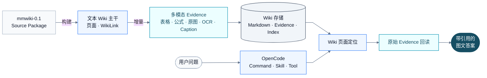

# Multimodal LLM Wiki

本仓库实现一套可构建、可检索、可追溯的多模态 LLM Wiki。系统以持久 Wiki 页面组织知识，以原始文字、完整表格、公式和图片作为事实证据，并通过 OpenCode 项目级 Skill 提供统一的构建检查和图文问答入口。

项目不直接解析 PDF。上游文档解析模块需要先输出符合 `mmwiki-0.1` 的 Source Package；本仓库从该数据包开始完成 Wiki 构建、多模态增量表示、分级检索和带引用回答。

## 项目概览

| 项目 | 当前实现 |
|---|---|
| 输入 | `mmwiki-0.1` Source Package：Item、Chunk、Asset 与 provenance |
| 构建 | 先生成文本 Wiki 主干，再增量加入表格、公式、原图、OCR 和 Image Caption |
| 存储 | Markdown Wiki 页面、不可变 Raw、副本资源、运行状态、文本/视觉索引 |
| 查询 | 先定位 Wiki 页面，再回读 Chunk、Item、Asset 原始 Evidence |
| 交互 | OpenCode Desktop + `multimodal-wiki` Skill + 类型化 `wiki_*` 工具 |
| 输出 | 结论、知识入口、编号证据卡片、完整表格/原图和运行信息 |

> OpenCode 是操作入口，不保存知识；Wiki 页面负责组织知识，原始 Evidence 负责证明答案。

## 快速开始

```bash
git clone git@github.com:yooa722/multimodal-llm-wiki.git
cd multimodal-llm-wiki

python3 -m venv .venv
source .venv/bin/activate
python3 -m pip install -r requirements.txt

cp .env.example .env
python3 app.py lint
```

按[模型配置](#模型配置)填写本机 `.env`。随后使用 OpenCode Desktop 打开仓库根目录，首次使用执行 `/connect` 配置 `bailian` Provider，再运行：

```text
/wiki-check
/wiki-start
/wiki-demo
```

仓库内置了 5 份可复现 Source Package。首次从数据包构建 Wiki 的命令见[从 Source Package 构建 Wiki](#从-source-package-构建-wiki)。
OpenCode 的类型化工具会按需自动启动本地展示服务；只有独立调用 HTTP API 时才需要手动运行 `python3 app.py api`。

## 总体技术路线



这条路线包含两个彼此独立但相互连接的过程：

1. **构建过程**把 Source Package 编译成可维护的 Wiki 页面和可回读的多模态 Evidence。
2. **查询过程**由 OpenCode 发起，先通过 Wiki 确定知识范围，再读取原始 Evidence 生成答案。

## Wiki 构建流程

```mermaid
%%{init: {"theme":"base","flowchart":{"curve":"linear","nodeSpacing":32,"rankSpacing":38},"themeVariables":{"fontFamily":"Inter, -apple-system, BlinkMacSystemFont, Segoe UI, sans-serif"}}}%%
flowchart LR
    A["Source Package<br/>Item · Chunk · Asset · provenance"] --> B["01  校验与归档<br/>Schema · 引用 · Path · SHA-256<br/>runtime/raw"]
    B -->|"阶段一"| C["02  文本 Wiki 主干<br/>来源页 · 知识页 · WikiLink<br/>Page / Evidence 文本索引"]
    C -->|"阶段二"| D["03  多模态增量<br/>完整表格 · 公式 · 原图<br/>Qwen3.5-OCR · Image Caption"]
    D --> E[("04  局部发布<br/>更新受影响页面与索引<br/>复用未变化向量")]

    class A,B neutral
    class C core
    class D multimodal
    class E storage
    classDef neutral fill:#F8FAFC,stroke:#94A3B8,color:#0F172A,stroke-width:1px
    classDef core fill:#EFF6FF,stroke:#3B82F6,color:#0F172A,stroke-width:1.3px
    classDef multimodal fill:#ECFEFF,stroke:#0891B2,color:#164E63,stroke-width:1.3px
    classDef storage fill:#F1F5F9,stroke:#475569,color:#0F172A,stroke-width:1.3px
    linkStyle default stroke:#64748B,stroke-width:1.2px
```



两个阶段复用同一组 `source_id + source_version + item_id`。OCR 和 Image Caption 是原始图片的派生子 Evidence：它们帮助检索，但不会替代原图，也不会为每张图片单独创建一套 Wiki 页面。

### 构建产物

| 产物 | 位置 | 用途 |
|---|---|---|
| 不可变来源副本 | `runtime/raw/<source>/<version>/` | 保留可复现输入，不允许构建阶段修改 |
| Wiki 页面 | `runtime/vault/wiki/` | 保存来源页、知识页、证据地图和 WikiLink |
| 原始资源 | `runtime/vault/assets/` | 保存查询时回读的图片和视觉 Evidence |
| 来源与派生 Evidence 状态 | `runtime/state.json` | 保存版本、Item/Chunk/Asset 和 `visual_evidence` |
| OCR/VLM 构建缓存 | `runtime/build-cache/visual/` | 相同图片、模型和提示词版本不重复调用 |
| 检索索引 | `runtime/retrieval-index.json` | 保存页面、文本 Evidence 和视觉 Evidence 向量 |

## Wiki 查询流程

```mermaid
%%{init: {"theme":"base","flowchart":{"curve":"linear","nodeSpacing":32,"rankSpacing":38},"themeVariables":{"fontFamily":"Inter, -apple-system, BlinkMacSystemFont, Segoe UI, sans-serif"}}}%%
flowchart LR
    U(["用户问题"]) --> O["OpenCode 调用层<br/>/wiki-* · Skill · wiki_* Tool"]
    O --> P["01  Wiki 页面定位<br/>Page BM25 · Page Embedding"]
    P --> E["02  Evidence 检索与原件回读<br/>BM25 · Vector · RRF · Rerank<br/>文字 · 表格 · 公式 · 原图"]
    E --> A["03  模型回答与引用校验<br/>Text LLM / VLM<br/>Evidence ID · Source Version"]
    A --> X(["OpenCode 展示<br/>结论 · 知识入口 · 证据卡片 · 运行信息"])
    X -.-> H["点击查看<br/>Wiki 页面 · 原图<br/>127.0.0.1:19828"]

    class U,H neutral
    class O,P core
    class E,A multimodal
    class X result
    classDef neutral fill:#F8FAFC,stroke:#94A3B8,color:#0F172A,stroke-width:1px
    classDef core fill:#EFF6FF,stroke:#3B82F6,color:#0F172A,stroke-width:1.3px
    classDef multimodal fill:#ECFEFF,stroke:#0891B2,color:#164E63,stroke-width:1.3px
    classDef storage fill:#F1F5F9,stroke:#475569,color:#0F172A,stroke-width:1.3px
    classDef result fill:#164E63,stroke:#164E63,color:#FFFFFF,stroke-width:1.3px
    linkStyle default stroke:#64748B,stroke-width:1.2px
```



查询默认使用 `auto`。后端根据功能开关和问题类型选择 `lexical`、`hybrid` 或 `multimodal`；OpenCode 命令层不重复实现检索判断。无论使用哪种模式，Wiki 页面只用于定位，最终结论必须由本次召回的原始 Evidence 支撑。

### 组件职责

| 组件 | 职责 | 不负责 |
|---|---|---|
| OpenCode | 接收自然语言和 `/wiki-*` 命令 | 不保存 Wiki，不直接实现检索 |
| Skill 与 Presenter Agent | 自由问答由专用 Agent 调用类型化工具，其余演示命令由通用 Agent 处理 | 不展示底层路由参数，不生成事实，不改写工具结果 |
| 类型化 `wiki_*` 工具 | 校验参数并安全调用 Python | 不用 Shell 拼接用户问题 |
| Python Wiki Pipeline | 构建页面、维护状态、检索 Evidence、调用模型 | 不修改上游 Source Package |
| Wiki 页面 | 组织概念、实体、分析和页面关系 | 不作为最终事实证明 |
| 原始 Evidence | 提供文字、表格、公式和图片事实 | 不自动写入稳定知识页 |

项目级 `wiki-result-passthrough` 插件会将后端生成的最终 Markdown 原样交给 OpenCode，避免二次生成阶段删除链接、完整表格、原图、公式或 Evidence ID。更详细的 Skill 结构见 [multimodal-wiki Skill 架构说明](.opencode/skills/multimodal-wiki/README.md)。

## 核心能力

- 两阶段、可幂等的文本 Wiki → 多模态增量构建。
- Wiki 页面优先、原始 Evidence 兜底的分层查询。
- 按资源类型组合原始 Caption、OCR、VLM Caption、结构化表格和 LaTeX，避免无差别调用高成本模型。
- BM25、页面向量、文本向量、视觉向量和 Rerank 的分级启用。
- 完整表格与命中原图回读，不用压缩文本代理冒充原始证据。
- Evidence ID、来源版本、模型、延迟、回退状态完整保留。
- WikiLink 图谱、页面版本、维护检查和证据不足拒答。

## 代码结构

```text
.
├── app.py                         # 统一 CLI 入口
├── mmwiki/
│   ├── contracts.py               # mmwiki-0.1 协议校验与路径安全
│   ├── models.py                  # Source、Item、Chunk、Asset 数据模型
│   ├── pipeline.py                # 构建、增量更新、查询与 Wiki 治理
│   ├── provider.py                # 文本/视觉模型调用与回答规范化
│   ├── retrieval.py               # 页面/Evidence 向量、RRF、Rerank 与分级检索
│   ├── search.py                  # Wiki 页面导航与 Evidence BM25
│   ├── ocr.py                     # Qwen3.5-OCR 调用与结果规范化
│   ├── visual_evidence.py         # OCR/Caption 派生 Evidence 索引映射
│   ├── markdown_overlay.py        # 既有 Markdown Wiki 的只读多模态派生视图
│   ├── api.py                     # 本地 HTTP API
│   └── web.py                     # Wiki 页面、WikiLink 和原图展示
├── config/
│   ├── purpose.md                 # Wiki 目标、范围和成功标准
│   └── schema.md                  # 页面类型、元数据和治理规则
├── .opencode/
│   ├── skills/multimodal-wiki/    # OpenCode 项目级 Skill
│   ├── commands/                  # /wiki-* 中文命令（统一使用 auto）
│   ├── agents/wiki-query-presenter.md # /wiki-ask 专用，用户气泡只保留问题
│   ├── agents/wiki-presenter.md   # 其余演示命令的低温度工具 Agent
│   ├── plugins/wiki-result-passthrough.ts # 最终 Markdown 确定性透传
│   └── tools/wiki.ts              # 类型化 OpenCode 工具
├── evaluation/                    # 检索与问答评测集
├── data/source_packages/          # 可复现当前 Wiki 的 5 份 mmwiki-0.1 数据包
├── tools/                         # 演示、评测、迁移与增量基准工具
├── tests/                         # 核心回归测试
├── OPENCODE_START_HERE.md         # OpenCode 桌面版快速使用说明
├── opencode.json                  # OpenCode 模型和权限配置
├── obsidian-plugin/               # 旧版可选浏览适配器，不参与主演示链路
└── .env.example                   # Wiki 管线模型配置模板
```

`runtime/`、`reports/`、`docs/`、原始 PDF 和本机凭据不属于可提交的核心代码，默认不会进入 Git。仓库只保留经过标准化和安全审计的 Source Package，用于复现构建结果。

## 环境要求

- Python 3.11 或更高版本
- OpenCode Desktop 或 OpenCode CLI
- 可选：兼容 OpenAI API 协议的文本、视觉、Embedding 和 Reranker 服务

安装 Python 依赖：

```bash
python3 -m venv .venv
source .venv/bin/activate
python3 -m pip install -r requirements.txt
```

## 模型配置

复制配置模板：

```bash
cp .env.example .env
```

在本机 `.env` 中配置：

```dotenv
MMWIKI_API_BASE_URL=https://your-endpoint.example.com/compatible-mode/v1
MMWIKI_API_KEY=your-api-key

MMWIKI_BUILD_MODEL=qwen3.7-plus
MMWIKI_VISION_MODEL=qwen3-vl-plus
MMWIKI_TEXT_EMBEDDING_MODEL=qwen3.7-text-embedding
MMWIKI_TEXT_RERANK_MODEL=qwen3-rerank
MMWIKI_VL_EMBEDDING_MODEL=qwen3-vl-embedding
MMWIKI_VL_RERANK_MODEL=qwen3-vl-rerank

# 轻量增量多模态 Wiki 默认值：Caption-first，VLM/向量按需开启
MMWIKI_ENABLE_VLM=false
MMWIKI_ENABLE_VECTOR_RETRIEVAL=false

# 图片证据派生信息（仅在 multimodal + --vlm on 时使用）
MMWIKI_OCR_MODEL=qwen3.5-ocr
MMWIKI_OCR_TASK=text_recognition
MMWIKI_OCR_API_URL=
MMWIKI_OCR_MIN_PIXELS=3072
MMWIKI_OCR_MAX_PIXELS=8388608
MMWIKI_VISION_BATCH_SIZE=8
```

`MMWIKI_OCR_API_URL` 可以留空。此时程序根据 `MMWIKI_API_BASE_URL` 自动推导百炼原生 OCR Endpoint；如果 `MMWIKI_OCR_MODEL` 未写入 `.env`，程序使用内置默认值 `qwen3.5-ocr`。`.env.example` 只是配置模板，不会作为运行时配置文件自动加载。

| 环节 | 默认模型 | 作用 |
|---|---|---|
| OpenCode Agent | `qwen3-coder-plus` | 理解 Skill、选择工具并组织交互 |
| 文本 Wiki 分析与编译 | `qwen3.7-plus` | 生成知识页、摘要和 WikiLink |
| 多模态分析与问答 | `qwen3-vl-plus` | 读取图片、表格和关联文字 |
| 页面/Evidence 文本向量 | `qwen3.7-text-embedding` | 语义定位 Wiki 页面和文本 Evidence |
| 文本重排 | `qwen3-rerank` | 重排 Hybrid 候选 |
| 视觉融合向量 | `qwen3-vl-embedding` | 建立图片与文本的联合表示 |
| 多模态重排 | `qwen3-vl-rerank` | 重排需要视觉理解的候选 |

Qwen3.5-OCR 不替代现有视觉模型：OCR 负责提取图片中的文字和数字，视觉模型负责生成图片语义 Caption。两者只在构建阶段产生派生 Evidence，不会在查询时临时调用 OCR。

`.env` 只供 Python Wiki 管线读取。OpenCode Agent 的账号凭据由 OpenCode 自身管理：首次使用时在 OpenCode 中执行 `/connect` 并连接 `bailian` Provider。凭据不应写入 `opencode.json`、Skill 或 Git。

## 输入协议

项目不直接解析 PDF，而是接收文档解析模块生成的 Source Package：

```text
<package>/
├── manifest.json
├── items.jsonl
├── chunks.jsonl
├── assets.json
└── assets/
    └── ...
```

关键语义：

| 文件 | 职责 |
|---|---|
| `manifest.json` | 声明 `mmwiki-0.1`、来源、解析器和产物路径 |
| `items.jsonl` | 保存原文、完整表格、公式、页码、资源引用和 provenance |
| `chunks.jsonl` | 保存检索单元，但不取代 Item 或原始资产 |
| `assets.json` | 保存资源路径、媒体类型和 SHA-256 |
| `assets/` | 保存图片、图表、表格截图和公式截图 |

Source Package 中的绝对路径、`../` 路径逃逸、悬空 Item/Asset 引用和错误 SHA-256 会被拒绝。

## 接入用户已有 Markdown Wiki

多模态能力以现有文本 Wiki 为基座，不另起一套视觉系统。原始 Wiki 只读，导入后生成派生视图：

```bash
python3 app.py ingest-wiki \
  /absolute/path/to/wiki \
  --caption-package /absolute/path/to/mmwiki-package
python3 app.py wiki-status
```

导入器支持本地相对路径的标准 Markdown 图片和 Obsidian 图片语法。它用图片内容 SHA-256 关联 MinerU Package 的资源与 Caption，将 Caption 写入派生 Markdown 的 `alt`，因此默认 BM25 可以直接检索图片语义；原 Markdown、图片和 WikiLink 不会被修改。远程、绝对和越界图片会被逐项报告，不会让整库导入失败。

查询默认使用 `auto`。在向量和 VLM 开关均关闭时，它使用 Page/Evidence BM25 并检索 Caption 等文本代理；开启增强能力后，后端再按问题类型进入 `hybrid` 或 `multimodal`。临时开启方式如下：

```bash
python3 app.py query "图片中的系统架构是什么？" \
  --retrieval-mode auto --vlm on --vector-retrieval on
```

开关关闭时不会调用 VLM、Embedding 或 Rerank，也不会删除已有向量索引。

## 仓库内置构建数据

`data/source_packages/` 提供当前活跃 Wiki 使用的 5 份 Source Package，共包含 212 个 Item、182 个 Chunk 和 28 个视觉 Asset，覆盖中文/英文文本、复杂表格、公式、图片和图表。

```bash
python3 app.py validate \
  data/source_packages/论文_002_cs_LG/1d9dabf3e92b
```

完整数据清单、版本和使用边界见 [data/README.md](data/README.md)。合同、简历和财报等已排除来源不随仓库上传。

## 从 Source Package 构建 Wiki

先校验输入：

```bash
python3 app.py validate /absolute/path/to/package
```

构建文本 LLM Wiki 基座：

```bash
python3 app.py ingest /absolute/path/to/package \
  --provider api \
  --stage text
python3 app.py build-index --text-only --vector-retrieval on
```

在同一来源版本上增量加入多模态能力：

```bash
python3 app.py ingest /absolute/path/to/package \
  --provider api \
  --stage multimodal \
  --vlm on
python3 app.py build-index --source-id <package-id> \
  --vlm on --vector-retrieval on
```

当 `--vlm on` 时，`multimodal` 阶段先识别资源类型，再按成本策略生成持久表示。普通构建由视觉模型按 `MMWIKI_VISION_BATCH_SIZE` 分批处理；`--full-scale` 直接复用页面级视觉分析中的图片注释，不额外重复调用一次视觉模型。处理计划和结果保存到 `state.sources[package_id].visual_evidence`，并在 Evidence 页的原始 Caption 下展示：

| 资源类型 | 主表示 | 持久处理策略 |
|---|---|---|
| 自然图片 | VLM Caption | Caption 优先；OCR 默认按需，不在构建时调用 |
| 流程图、图表 | OCR + VLM Caption | 同时提取图中文字与整体结构语义 |
| 表格截图 | `rows/cells/html` 结构化表格 | 结构化结果优先；OCR 仅辅助核对，不默认生成普通 Caption |
| 公式 | LaTeX | 不默认生成普通 Caption 或 OCR |
| 页面截图 | OCR + VLM Caption | 同时保留页面文字和版面语义 |

类型优先读取 Source Package 的 `metadata.visual_type/resource_type/image_type`；未提供时再根据 Item 类型、Caption 和 breadcrumb 做保守判断。每条派生 Evidence 均记录 `processing_policy`，运行统计会给出各类型数量、计划 OCR 数和计划 Caption 数。

```markdown
**原始 Caption：** (b) ReToken achieves more than 3x recall...

**Image Caption：**
图中展示不同层的 Recall@1 曲线。

**Image OCR：**
Layer 14 附近的 Recall@1 约为 6.8%。
```

`Image Caption` 和 `Image OCR` 会作为图片的派生子 Evidence 进入 BM25；配置文本向量模型并开启向量检索后，也会进入文本向量索引，但不会重复建立视觉向量。查询 `6.8` 时命中的派生记录仍通过父级 Item、Chunk 和 Asset 返回原图。

图片内容按 SHA-256 缓存在 `runtime/build-cache/visual/`。相同图片、模型、任务和提示词版本不重复调用 OCR/VLM；单张图片或单个批次失败会保留失败状态，不阻断其他图片处理。Pipeline 还会保存不含密钥的视觉构建契约与签名；同一来源先以 `--vlm off` 构建、再切换为 `--vlm on` 时会补建派生视觉 Evidence，而不会被错误判定为 `unchanged`。默认关闭向量检索不会删除已有索引。

验证图片证据检索：

```bash
python3 app.py search "哪个图片提到了6.8" \
  --source-id <package-id> \
  --top-k 5
```

`--full-scale` 按页读取全部原图并统一编译 Wiki，同时将页面级分析结果复用为持久 Caption 子 Evidence；OCR 独立执行，但不再为 Caption 增加第二轮视觉模型调用。重复执行相同来源版本和构建签名时直接返回 `unchanged`，模型调用为 0。

如果现有 Evidence 索引完整、只缺少独立 Wiki 页面向量，执行：

```bash
python3 app.py build-wiki-index --vector-retrieval on
```

## 在 OpenCode 中使用

1. 使用 OpenCode Desktop 打开本仓库根目录。
2. 首次使用时输入 `/connect`，为 `bailian` Provider 配置个人 API Key。
3. 完全退出并重新打开一次 OpenCode，使项目级命令、Agent、工具和结果透传插件生效。
4. 在对话框输入：

   ```text
   /wiki-start
   ```

5. 按以下顺序检查和演示：

| 命令 | 作用 | 是否调用在线问答模型 |
|---|---|---|
| `/wiki-start` | 解释 OpenCode、Wiki 和 Evidence 的关系 | 否 |
| `/wiki-check` | 检查数据、索引、模型和本地展示服务 | 否 |
| `/wiki-demo` | 展示 Wiki 构建链路和原始多模态 Evidence | 否 |
| `/wiki-compare` | 展示文本基线与多模态增量指标 | 否 |
| `/wiki-questions` | 展示适合现场演示的问题清单 | 否 |
| `/wiki-table` | 演示完整表格回读 | 是 |
| `/wiki-image` | 演示原图理解 | 是 |
| `/wiki-refuse` | 演示证据不足拒答 | 是 |
| `/wiki-ask <问题>` | 以 `auto` 查询；默认 Caption-first，增强能力按开关启用 | 是 |

所有 `/wiki-*` 命令正文只保留用户可读的自然语言。`/wiki-ask` 由专用 `wiki-query-presenter` 调用 `wiki_query`，其余固定演示命令由 `wiki-presenter` 选择对应的类型化工具；工具名、检索模式和 Provider 等底层路由参数仅存在于 Agent 配置中，不会出现在用户消息气泡里。修改 `.opencode` 后必须完全退出并重新打开 OpenCode Desktop，已有历史消息不会自动重新渲染。

自由问题示例：

```text
/wiki-ask 请结合原图解释 Figure 4 的数据流，并给出 Evidence ID。
```

正式回答固定包含：

1. **结论**：直接回答，或明确说明证据不足；事实后使用 `〔1〕` 短引用。
2. **知识入口**：只展示最多两个最相关的 Wiki 页面，不显示内部检索通道和长摘要。
3. **证据依据**：正文中的 `〔1〕` 直接对应下方 `〔1〕` 证据卡片，不再增加重复的引用索引。卡片集中展示来源、页码、类型、Evidence ID、Wiki/原图链接和完整表格；图片卡片先展示原图，再分别标注 VLM 理解、OCR 文字和 MinerU 原始 Caption 及其来源。
4. **运行信息**：展示检索模式、模型、回退、延迟和 Token。

OpenCode 对话是默认的完整问答页面，用户不离开 OpenCode 也能看完结论、证据、表格和图片。双栏核验页可在“Wiki 页面”和“原始 Evidence”之间切换，并可在多个证据编号之间切换，但它只是可选的进一步核验入口。

更详细的桌面版操作说明见 [OPENCODE_START_HERE.md](OPENCODE_START_HERE.md)。

## 检索模式

| 模式 | 组成 | 推荐场景 |
|---|---|---|
| `lexical` | Page BM25、WikiLink 权威度和 Evidence BM25 | 离线兜底、编号和精确关键词 |
| `hybrid` | Wiki 页面语义导航、文本向量、RRF 和文本 Rerank | 显式开启向量后的文字、事实、表格语义和跨语言问题 |
| `multimodal` | Hybrid、视觉融合向量和视觉 Rerank | 颜色、布局、箭头、曲线、形状和像素细节 |

Hybrid 在检索与回答阶段都优先使用文本、结构化表格、OCR 和 Caption，不读取图片像素；Multimodal 才会在召回、重排和回答阶段使用视觉信息，因此成本和延迟通常更高。`auto` 统一识别颜色/深浅、位置/方向、箭头/连接、曲线/趋势、物体/场景及视觉数量/空间关系：明确视觉问题直接进入 Multimodal，普通文字、数字和表格问题进入 Hybrid。若 Hybrid 回答明确判断证据不足、候选 Evidence 又关联原图，系统可再自动升级一次 Multimodal。运行信息会同时记录请求模式、初始模式、实际模式、路由依据、升级链路和回退原因。

## CLI 与本地 API

常用 CLI：

```bash
python3 app.py search "问题" --retrieval-mode auto --top-k 5
python3 app.py query "问题" --retrieval-mode auto --provider api
python3 app.py query "视觉问题" --retrieval-mode auto --provider api --vlm on --vector-retrieval on
python3 app.py lint
```

启动本机 API：

```bash
python3 app.py api --host 127.0.0.1 --port 19828
```

| 方法 | 路径 | 用途 |
|---|---|---|
| `GET` | `/api/v1/health` | 模型与索引状态 |
| `GET` | `/api/v1/sources` | 已摄入来源 |
| `GET` | `/query/view?id=...&evidence=1` | 左侧问答、右侧 Wiki/Evidence 的双栏核验页 |
| `GET` | `/wiki/view?path=wiki/...md` | 渲染 Wiki 页面和 WikiLink |
| `GET` | `/api/v1/media/assets/...` | 返回原始视觉 Evidence |
| `POST` | `/api/v1/search` | Wiki 导航与 Evidence 检索 |
| `POST` | `/api/v1/query` | 带引用的图文问答 |

默认只允许监听 `127.0.0.1`。没有独立鉴权和网络隔离时，不要暴露到公网。

## 测试与评测

运行全部回归测试：

```bash
python3 -m unittest discover -s tests -v
```

检查 Wiki 页面、来源版本、Evidence、图谱和维护状态：

```bash
python3 app.py lint
```

校验并运行评测：

```bash
python3 tools/validate_evaluation_suite.py evaluation/multimodal_wiki_40.jsonl
python3 tools/evaluate_retrieval.py \
  --suite evaluation/multimodal_wiki_40.jsonl \
  --retrieval-mode hybrid
```

运行文本 Wiki → 多模态增量的工程基准：

```bash
python3 tools/benchmark_staged_pipeline.py --offline
```

离线确定性基准用于验证阶段耗时、向量复用和增量正确性，不代表在线模型问答质量。

## 数据与安全

- API Key 只能放在 `.env`、系统环境变量或 OpenCode 凭据存储中。
- `runtime/raw/<package-id>/<version>/` 是不可变来源副本。
- 所有稳定知识页必须记录 `source_ids`、`source_versions` 和 `evidence_ids`。
- Query 只追加日志，不自动把回答写入稳定知识页。
- 外部模型可能接收候选文字、表格或图片；敏感数据必须先取得外发授权。
- Git 默认排除 `.env`、`runtime/`、`reports/`、`docs/`、原始文档和本地展示工程。

## 协作与提交

建议从 `main` 创建功能分支：

```bash
git checkout -b feature/<name>
```

提交前必须运行：

```bash
python3 -m unittest discover -s tests -v
python3 app.py lint
git diff --check
```

修改 `mmwiki-0.1` 输入协议时，必须同步更新协议说明、README 和测试；修改 OpenCode 工具后，需要完全重启 OpenCode Desktop 验证命令加载。
