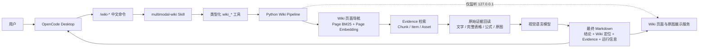
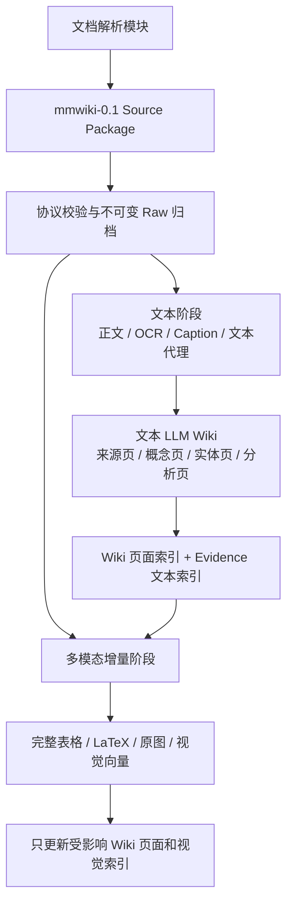

# OpenCode × 多模态 LLM Wiki

本项目实现一套以 **OpenCode 为交互入口、以 LLM Wiki 为知识骨架、以原始多模态 Evidence 为事实依据**的可追溯知识系统。

系统接收文档解析模块输出的 `mmwiki-0.1` Source Package，先构建可浏览、可链接、可维护的文本 LLM Wiki，再在同一来源版本上增量加入完整表格、公式、原图、视觉向量和视觉语言模型能力。用户在 OpenCode 中通过项目级 Skill 和类型化工具完成构建检查、Wiki 导航、图文问答与证据回跳。

> OpenCode 是操作台，不是知识库；Wiki 页面负责组织知识，原始 Evidence 负责证明答案，检索与模型只负责定位和理解。

## 核心能力

- **OpenCode 原生联动**：提供项目级 Skill、中文斜杠命令和类型化 `wiki_*` 工具。
- **Wiki-first 查询**：先定位持久 Wiki 页面，再下钻到 Chunk、Item、表格、公式和图片 Evidence。
- **两阶段构建**：先形成文本 Wiki 基座，再增量加入多模态表示，不重建不受影响的文本向量。
- **三种检索模式**：支持 `lexical`、`hybrid` 和 `multimodal`，默认优先使用成本更低的 Hybrid。
- **原始证据回读**：表格问题读取完整 `rows/cells/html`，视觉问题回读命中的原图，不用 Caption 冒充原始事实。
- **可追溯回答**：回答保留 Wiki 页面、Evidence ID、来源版本、原图/表格、模型、延迟和回退状态。
- **稳定展示**：Wiki 链接和图片通过本机 HTTP 服务打开；数学公式自动规范化为 OpenCode KaTeX 支持的格式。
- **增量与治理**：支持内容指纹、幂等摄入、页面版本、WikiLink 图谱、维护检查和证据不足拒答。

## OpenCode 与多模态 Wiki 如何联动



联动链路有三项关键约束：

1. OpenCode 只负责理解意图和调用工具，不直接替代 Wiki 管线。
2. `wiki_query` 使用结构化参数传递完整问题，不把用户问题拼接成 Shell 命令。
3. OpenCode 原样展示工具生成的最终 Markdown，不二次压缩答案、链接、表格或原图。

## Wiki 构建路线



文本阶段和多模态阶段使用相同的 `source_id + source_version + item_id`。多模态信息是对文本 Wiki 的增量增强，不会建立一套脱离 Wiki 的平行知识库。

## 代码结构

```text
.
├── app.py                         # 统一 CLI 入口
├── mmwiki/
│   ├── contracts.py               # mmwiki-0.1 协议校验与路径安全
│   ├── models.py                  # Source、Item、Chunk、Asset 数据模型
│   ├── pipeline.py                # 构建、增量更新、查询与 Wiki 治理
│   ├── provider.py                # 文本/视觉模型调用与回答规范化
│   ├── retrieval.py               # Wiki 页面导航与 Evidence 检索编排
│   ├── search.py                  # BM25、向量融合、Rerank 与增量索引
│   ├── api.py                     # 本地 HTTP API
│   └── web.py                     # Wiki 页面、WikiLink 和原图展示
├── config/
│   ├── purpose.md                 # Wiki 目标、范围和成功标准
│   └── schema.md                  # 页面类型、元数据和治理规则
├── .opencode/
│   ├── skills/multimodal-wiki/    # OpenCode 项目级 Skill
│   ├── commands/                  # /wiki-* 中文命令
│   └── tools/wiki.ts              # 类型化 OpenCode 工具
├── evaluation/                    # 检索与问答评测集
├── tools/                         # 演示、评测、迁移与增量基准工具
├── tests/                         # 核心回归测试
├── OPENCODE_START_HERE.md         # OpenCode 桌面版快速使用说明
├── opencode.json                  # OpenCode 模型和权限配置
├── obsidian-plugin/               # 旧版可选浏览适配器，不参与主演示链路
└── .env.example                   # Wiki 管线模型配置模板
```

`runtime/`、`reports/`、`docs/`、原始文档和本机凭据不属于可提交的核心代码，默认不会进入 Git。

## 环境要求

- Python 3.11 或更高版本
- OpenCode Desktop 或 OpenCode CLI
- 可选：兼容 OpenAI API 协议的文本、视觉、Embedding 和 Reranker 服务

安装 Python 依赖：

```bash
python3 -m venv .venv
source .venv/bin/activate
python3 -m pip install -r requirements.txt
```

## 模型配置

复制配置模板：

```bash
cp .env.example .env
```

在本机 `.env` 中配置：

```dotenv
MMWIKI_API_BASE_URL=https://your-endpoint.example.com/compatible-mode/v1
MMWIKI_API_KEY=your-api-key

MMWIKI_BUILD_MODEL=qwen3.7-plus
MMWIKI_VISION_MODEL=qwen3-vl-plus
MMWIKI_TEXT_EMBEDDING_MODEL=qwen3.7-text-embedding
MMWIKI_TEXT_RERANK_MODEL=qwen3-rerank
MMWIKI_VL_EMBEDDING_MODEL=qwen3-vl-embedding
MMWIKI_VL_RERANK_MODEL=qwen3-vl-rerank
```

| 环节 | 默认模型 | 作用 |
|---|---|---|
| OpenCode Agent | `qwen3-coder-plus` | 理解 Skill、选择工具并组织交互 |
| 文本 Wiki 分析与编译 | `qwen3.7-plus` | 生成知识页、摘要和 WikiLink |
| 多模态分析与问答 | `qwen3-vl-plus` | 读取图片、表格和关联文字 |
| 页面/Evidence 文本向量 | `qwen3.7-text-embedding` | 语义定位 Wiki 页面和文本 Evidence |
| 文本重排 | `qwen3-rerank` | 重排 Hybrid 候选 |
| 视觉融合向量 | `qwen3-vl-embedding` | 建立图片与文本的联合表示 |
| 多模态重排 | `qwen3-vl-rerank` | 重排需要视觉理解的候选 |

`.env` 只供 Python Wiki 管线读取。OpenCode Agent 的账号凭据由 OpenCode 自身管理：首次使用时在 OpenCode 中执行 `/connect` 并连接 `bailian` Provider。凭据不应写入 `opencode.json`、Skill 或 Git。

## 输入协议

项目不直接解析 PDF，而是接收文档解析模块生成的 Source Package：

```text
<package>/
├── manifest.json
├── items.jsonl
├── chunks.jsonl
├── assets.json
└── assets/
    └── ...
```

关键语义：

| 文件 | 职责 |
|---|---|
| `manifest.json` | 声明 `mmwiki-0.1`、来源、解析器和产物路径 |
| `items.jsonl` | 保存原文、完整表格、公式、页码、资源引用和 provenance |
| `chunks.jsonl` | 保存检索单元，但不取代 Item 或原始资产 |
| `assets.json` | 保存资源路径、媒体类型和 SHA-256 |
| `assets/` | 保存图片、图表、表格截图和公式截图 |

Source Package 中的绝对路径、`../` 路径逃逸、悬空 Item/Asset 引用和错误 SHA-256 会被拒绝。

## 从 Source Package 构建 Wiki

先校验输入：

```bash
python3 app.py validate /absolute/path/to/package
```

构建文本 LLM Wiki 基座：

```bash
python3 app.py ingest /absolute/path/to/package \
  --provider api \
  --stage text
python3 app.py build-index --text-only
```

在同一来源版本上增量加入多模态能力：

```bash
python3 app.py ingest /absolute/path/to/package \
  --provider api \
  --stage multimodal
python3 app.py build-index --source-id <package-id>
```

需要逐页读取全部视觉资源时，可在多模态阶段增加 `--full-scale`。同一内容重复摄入应返回 `unchanged`，不会重复调用模型。

如果现有 Evidence 索引完整、只缺少独立 Wiki 页面向量，执行：

```bash
python3 app.py build-wiki-index
```

## 在 OpenCode 中使用

1. 使用 OpenCode Desktop 打开本仓库根目录。
2. 首次使用时输入 `/connect`，为 `bailian` Provider 配置个人 API Key。
3. 完全退出并重新打开一次 OpenCode，使 `.opencode/tools/wiki.ts` 生效。
4. 在对话框输入：

   ```text
   /wiki-start
   ```

5. 按以下顺序检查和演示：

| 命令 | 作用 | 是否调用在线问答模型 |
|---|---|---|
| `/wiki-start` | 解释 OpenCode、Wiki 和 Evidence 的关系 | 否 |
| `/wiki-check` | 检查数据、索引、模型和本地展示服务 | 否 |
| `/wiki-demo` | 展示 Wiki 构建链路和原始多模态 Evidence | 否 |
| `/wiki-compare` | 展示文本基线与多模态增量指标 | 否 |
| `/wiki-table` | 演示完整表格回读 | 是 |
| `/wiki-image` | 演示原图理解 | 是 |
| `/wiki-refuse` | 演示证据不足拒答 | 是 |
| `/wiki-ask <问题>` | 自由查询并自动选择检索模式 | 是 |

自由问题示例：

```text
/wiki-ask 请结合原图解释 Figure 4 的数据流，并给出 Evidence ID。
```

正式回答固定包含：

1. **结论**：直接回答，或明确说明证据不足。
2. **Wiki 定位**：展示用于确定知识位置的页面。
3. **原始 Evidence**：展示 Evidence ID、完整表格或命中的原图。
4. **运行信息**：展示检索模式、模型、回退、延迟和 Token。

更详细的桌面版操作说明见 [OPENCODE_START_HERE.md](OPENCODE_START_HERE.md)。

## 检索模式

| 模式 | 组成 | 推荐场景 |
|---|---|---|
| `lexical` | Page BM25、WikiLink 权威度和 Evidence BM25 | 离线兜底、编号和精确关键词 |
| `hybrid` | Wiki 页面语义导航、文本向量、RRF 和文本 Rerank | 默认模式；文字、事实、表格语义和跨语言问题 |
| `multimodal` | Hybrid、视觉融合向量和视觉 Rerank | 颜色、布局、箭头、曲线、形状和像素细节 |

Hybrid 在检索阶段不读取图片像素，但最终回答仍可回读命中 Evidence 关联的原图。Multimodal 从召回和重排阶段开始使用视觉信息，因此成本和延迟通常更高。

## CLI 与本地 API

常用 CLI：

```bash
python3 app.py search "问题" --retrieval-mode hybrid --top-k 5
python3 app.py query "问题" --retrieval-mode hybrid --provider api
python3 app.py query "视觉问题" --retrieval-mode multimodal --provider api
python3 app.py lint
```

启动本机 API：

```bash
python3 app.py api --host 127.0.0.1 --port 19828
```

| 方法 | 路径 | 用途 |
|---|---|---|
| `GET` | `/api/v1/health` | 模型与索引状态 |
| `GET` | `/api/v1/sources` | 已摄入来源 |
| `GET` | `/wiki/view?path=wiki/...md` | 渲染 Wiki 页面和 WikiLink |
| `GET` | `/api/v1/media/assets/...` | 返回原始视觉 Evidence |
| `POST` | `/api/v1/search` | Wiki 导航与 Evidence 检索 |
| `POST` | `/api/v1/query` | 带引用的图文问答 |

默认只允许监听 `127.0.0.1`。没有独立鉴权和网络隔离时，不要暴露到公网。

## 测试与评测

运行全部回归测试：

```bash
python3 -m unittest discover -s tests -v
```

检查 Wiki 页面、来源版本、Evidence、图谱和维护状态：

```bash
python3 app.py lint
```

校验并运行评测：

```bash
python3 tools/validate_evaluation_suite.py evaluation/multimodal_wiki_40.jsonl
python3 tools/evaluate_retrieval.py \
  --suite evaluation/multimodal_wiki_40.jsonl \
  --retrieval-mode hybrid
```

运行文本 Wiki → 多模态增量的工程基准：

```bash
python3 tools/benchmark_staged_pipeline.py --offline
```

离线确定性基准用于验证阶段耗时、向量复用和增量正确性，不代表在线模型问答质量。

## 数据与安全

- API Key 只能放在 `.env`、系统环境变量或 OpenCode 凭据存储中。
- `runtime/raw/<package-id>/<version>/` 是不可变来源副本。
- 所有稳定知识页必须记录 `source_ids`、`source_versions` 和 `evidence_ids`。
- Query 只追加日志，不自动把回答写入稳定知识页。
- 外部模型可能接收候选文字、表格或图片；敏感数据必须先取得外发授权。
- Git 默认排除 `.env`、`runtime/`、`reports/`、`docs/`、原始文档和本地展示工程。

## 协作与提交

建议从 `main` 创建功能分支：

```bash
git checkout -b feature/<name>
```

提交前必须运行：

```bash
python3 -m unittest discover -s tests -v
python3 app.py lint
git diff --check
```

修改 `mmwiki-0.1` 输入协议时，必须同步更新协议说明、README 和测试；修改 OpenCode 工具后，需要完全重启 OpenCode Desktop 验证命令加载。
