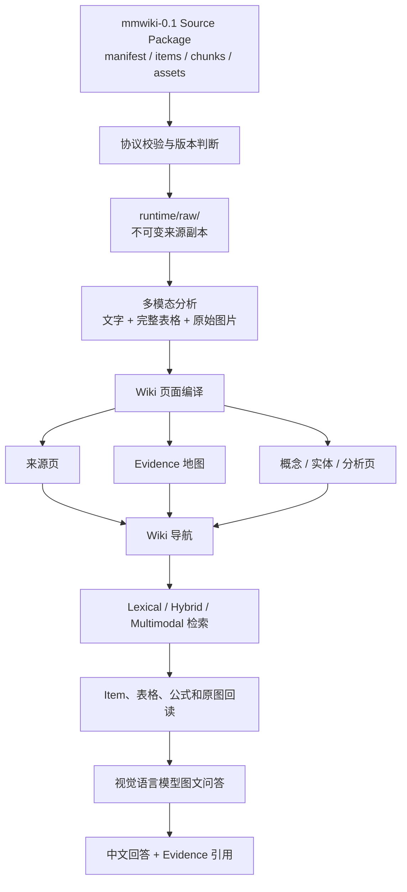

# 多模态 LLM Wiki

本项目实现一套以 Wiki 为知识组织骨架、以原始多模态 Evidence 为事实依据的 LLM Wiki 系统。系统接收符合 `mmwiki-0.1` 协议的 Source Package，将文字、完整表格、图片、图表和公式组织为可浏览、可追溯、可增量维护的 Markdown Wiki；查询时先利用 Wiki 定位知识，再回读原始 Evidence，由视觉语言模型生成带引用的中文回答。Wiki 可由 Obsidian 或其他兼容客户端浏览，核心管线不依赖特定交互界面。

本项目不负责直接解析 PDF，也不把向量检索等同于 Wiki。文档解析模块负责生成标准 Source Package；本项目从 Source Package 开始，负责协议校验、来源归档、Wiki 构建、知识导航、Evidence 检索、原始证据回读和图文问答。

## 核心能力

- 校验 `mmwiki-0.1` Source Package，并阻止绝对路径和 `../` 路径逃逸。
- 按内容版本保存不可变来源副本；相同内容重复摄入时返回 `unchanged`。
- 生成多模态来源页、Evidence 地图、概念页、实体页和分析页。
- 使用统一 Evidence ID 关联来源、版本、Item、表格、公式和视觉资源。
- 支持 `lexical`、`hybrid` 和 `multimodal` 三档检索模式。
- 检索命中后回读原始文字、完整表格、LaTeX 和图片，而不是仅依赖 Caption 或 Chunk 摘要。
- 使用视觉语言模型生成带 Evidence 引用的中文回答，并在证据不足时拒答。
- 提供稳定的本地 HTTP API；Obsidian 插件作为可选客户端适配器，其他客户端可复用同一接口。
- 提供评测、回归测试、Wiki Lint、图谱健康检查和查询 Trace。

## 系统架构



系统遵循以下原则：

1. **Wiki 是知识组织骨架。**页面、目录、WikiLink、版本、图谱和日志负责组织长期知识。
2. **Evidence 是事实依据。**页面结论和回答必须能够回到具体来源版本、Item、表格、公式或原图。
3. **检索和模型是辅助组件。**向量库、Reranker 和视觉模型服务于 Wiki 构建与查询，不能覆盖原始事实。

## Source Package 协议

本项目的输入必须符合 `mmwiki-0.1` 协议。典型目录如下：

```text
<package>/
├── manifest.json
├── items.jsonl
├── chunks.jsonl
├── assets.json
├── assets/
└── raw/
```

主要文件职责如下：

| 文件 | 职责 |
|---|---|
| `manifest.json` | 记录 Package、文档、解析器、产物路径和交接字段 |
| `items.jsonl` | 保存原始事实，包括正文、完整表格、公式、页码和资源引用 |
| `chunks.jsonl` | 保存用于关键词和向量检索的文本代理，以及 Item/Asset 引用 |
| `assets.json` | 保存视觉资源索引、媒体类型、摘要和相对路径 |
| `assets/` | 保存原始图片、图表、表格截图和公式截图 |

Chunk 只负责召回。表格精确数值必须从 `items.jsonl` 中的完整表格结构读取；图片问题必须在需要时回读 `assets/` 中的原图。

## 目录结构

```text
multimodal-llm-wiki/
├── app.py                    # 命令行入口
├── mmwiki/                   # 核心 Wiki、检索、模型和 API 实现
│   ├── api.py
│   ├── contracts.py
│   ├── models.py
│   ├── pipeline.py
│   ├── provider.py
│   ├── retrieval.py
│   └── search.py
├── config/
│   └── schema.md             # Wiki 页面 Schema 和治理规则
├── obsidian-plugin/          # 可选的 Obsidian 本地查询适配器
├── evaluation/               # 检索与问答评测用例
├── tests/                    # 回归测试
├── tools/                    # 通用转换、评测和检查工具
├── .env.example              # 环境变量模板
├── requirements.txt
└── README.md
```

运行过程中会自动生成 `runtime/`，其中包含不可变来源副本、Wiki Vault、查询记录和检索索引。该目录可能包含原始文档和派生数据，默认不纳入 Git。

## 环境要求

- Python 3.11 或更高版本
- Obsidian 1.5 或更高版本（仅使用 Obsidian 插件时需要）
- 可选：兼容 OpenAI API 协议的文本模型、视觉模型、Embedding 和 Reranker 服务

安装 Python 依赖：

```bash
python3 -m venv .venv
source .venv/bin/activate
python3 -m pip install -r requirements.txt
```

## 环境变量

复制环境变量模板：

```bash
cp .env.example .env
```

在 `.env` 中配置模型服务。不得把真实 API Key 提交到 Git。

```dotenv
MMWIKI_API_BASE_URL=https://your-workspace.example.com/compatible-mode/v1
MMWIKI_API_KEY=

MMWIKI_BUILD_MODEL=qwen3.7-plus
MMWIKI_VISION_MODEL=qwen3-vl-plus
MMWIKI_TEXT_EMBEDDING_MODEL=qwen3.7-text-embedding
MMWIKI_TEXT_RERANK_MODEL=qwen3-rerank
MMWIKI_VL_EMBEDDING_MODEL=qwen3-vl-embedding
MMWIKI_VL_RERANK_MODEL=qwen3-vl-rerank

MMWIKI_EMBEDDING_DIMENSION=1024
MMWIKI_TIMEOUT=60
MMWIKI_MAX_IMAGES=4
MMWIKI_MAX_OUTPUT_TOKENS=3000
```

模型职责如下：

| 环节 | 默认模型 | 职责 |
|---|---|---|
| Wiki 多模态分析 | `qwen3-vl-plus` | 理解文字、完整表格和原图，生成论点与页面计划 |
| Wiki 页面编译 | `qwen3.7-plus` | 把结构化分析结果编译为 Markdown 知识页 |
| 文本向量召回 | `qwen3.7-text-embedding` | 生成 Chunk 和查询的文本向量 |
| 文本重排 | `qwen3-rerank` | 对 Hybrid 文本候选重新排序 |
| 多模态向量召回 | `qwen3-vl-embedding` | 为原图和关联文本生成融合向量 |
| 多模态重排 | `qwen3-vl-rerank` | 直接重排文本与图片候选 |
| 最终图文问答 | `qwen3-vl-plus` | 读取结构化 Evidence、完整表格和原图并生成带引用回答 |

## 快速开始

### 1. 校验 Source Package

```bash
python3 app.py validate /absolute/path/to/package
```

校验内容包括 Manifest、Item、Chunk、Asset、引用完整性和路径安全性。

### 2. 构建 Wiki

不调用外部模型的基线构建：

```bash
python3 app.py ingest /absolute/path/to/package --provider baseline
```

调用模型完成多模态 Wiki 构建：

```bash
python3 app.py ingest /absolute/path/to/package --provider api
```

对视觉资源较多的长文档执行逐页全量构建：

```bash
python3 app.py ingest /absolute/path/to/package \
  --provider api \
  --full-scale
```

相同内容重复摄入时不会重复构建。如需显式重建，增加 `--force`。

### 3. 构建检索索引

构建文本与多模态索引：

```bash
python3 app.py build-index
```

只构建文本索引：

```bash
python3 app.py build-index --text-only
```

增量更新指定来源：

```bash
python3 app.py build-index --source-id <source-id>
```

### 4. 执行 Evidence 检索

```bash
python3 app.py search "问题内容" \
  --retrieval-mode hybrid \
  --top-k 5
```

### 5. 执行带引用的图文问答

```bash
python3 app.py query "问题内容" \
  --retrieval-mode hybrid \
  --top-k 5
```

需要直接理解颜色、布局、曲线或图片内容时使用：

```bash
python3 app.py query "问题内容" \
  --retrieval-mode multimodal \
  --top-k 5
```

## 检索模式

| 模式 | 组成 | 适用场景 |
|---|---|---|
| `lexical` | Wiki 导航、BM25、中文二元组、编号和模态加权 | 本地基线和外部检索服务不可用时的兜底 |
| `hybrid` | Lexical、文本向量、RRF 和文本重排 | 默认模式；适合同义表达、跨语言和文本/表格问题 |
| `multimodal` | Hybrid、图片融合向量和视觉重排 | 颜色、布局、形状、曲线和图片内容问题 |

Hybrid 检索阶段不直接读取图片像素，但最终问答可以回读命中 Evidence 关联的原图。Multimodal 从召回和重排阶段开始直接使用图片。

## 本地 API

启动本地服务：

```bash
python3 app.py api
```

服务默认监听 `127.0.0.1:19828`。

| 方法 | 路径 | 说明 |
|---|---|---|
| `GET` | `/api/v1/health` | 查询模型和检索索引状态 |
| `GET` | `/api/v1/sources` | 获取已摄入来源及可用模态 |
| `POST` | `/api/v1/search` | 执行 Wiki 导航和 Evidence 检索 |
| `POST` | `/api/v1/query` | 执行检索、证据回读和图文问答 |

HTTP API 默认仅监听本机回环地址。除非已部署独立的鉴权和网络隔离措施，否则不得将服务直接暴露到公网。

## Obsidian 插件（可选）

1. 启动本地 API：

   ```bash
   python3 app.py api
   ```

2. 将 `obsidian-plugin/` 中的文件复制到 Vault：

   ```text
   <vault>/.obsidian/plugins/multimodal-wiki-query/
   ```

3. 在 Obsidian 的“第三方插件”设置中启用 `Multimodal Wiki Query`。
4. 打开查询面板，选择检索模式并提交问题。

插件只调用本地 API，不读取 `.env`，也不会把查询答案自动写入稳定知识页。

核心 Wiki、检索和问答能力均由 Python 管线与本地 HTTP API 提供，不依赖 Obsidian。后续接入 OpenCode 或其他客户端时，应优先复用 `/api/v1/search` 和 `/api/v1/query`，仅新增客户端适配层。

## 质量检查与测试

运行全部回归测试：

```bash
python3 -m unittest discover -s tests -v
```

检查 Wiki 页面、Evidence、资源、图谱和来源版本：

```bash
python3 app.py lint
```

校验评测集：

```bash
python3 tools/validate_evaluation_suite.py evaluation/multimodal_wiki_40.jsonl
```

运行检索评测：

```bash
python3 tools/evaluate_retrieval.py \
  --suite evaluation/multimodal_wiki_40.jsonl \
  --retrieval-mode hybrid
```

运行在线图文问答评测：

```bash
python3 tools/evaluate_online.py \
  --suite evaluation/multimodal_wiki_40.jsonl \
  --retrieval-mode multimodal
```

评测输出默认写入 `reports/`。该目录用于本地实验结果，不纳入 Git。

## 数据与安全约束

- API Key 只能保存在 `.env` 或进程环境变量中。
- `runtime/raw/<package-id>/<version>/` 为不可变来源副本，不应手工覆盖。
- 稳定知识页必须记录 `source_ids`、`source_versions` 和 `evidence_ids`。
- Query 不自动写入知识页；需要沉淀为知识时必须重新经过 Evidence 校验的构建流程。
- Source Package 中的绝对路径和 `../` 路径会被拒绝。
- 原始文档、运行数据、查询历史和向量索引默认不提交到 Git。
- 使用外部模型处理敏感文档前，必须取得相应的数据外发授权。

## 协作规范

建议从 `main` 创建独立功能分支：

```bash
git checkout -b feature/<功能名称>
```

提交前必须运行：

```bash
python3 -m unittest discover -s tests -v
python3 app.py lint
```

通过 Pull Request 合并到 `main`。修改 Source Package 输入协议时，必须同步更新本 README、Schema 和相关测试。
